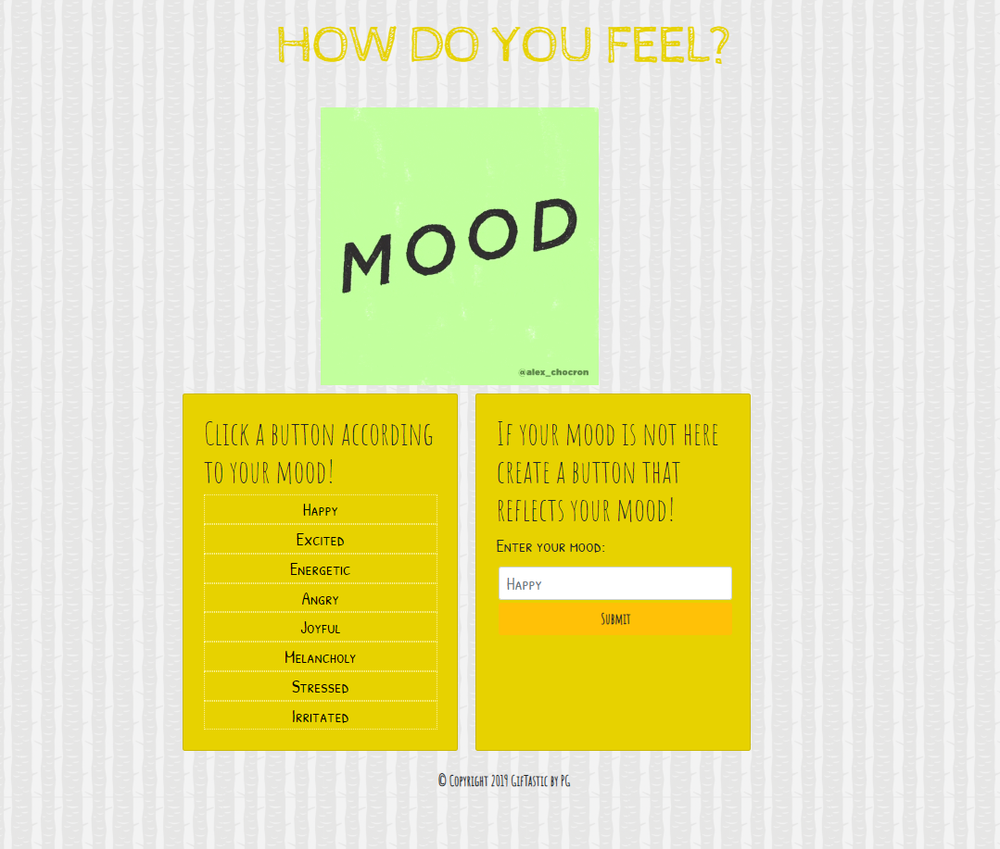
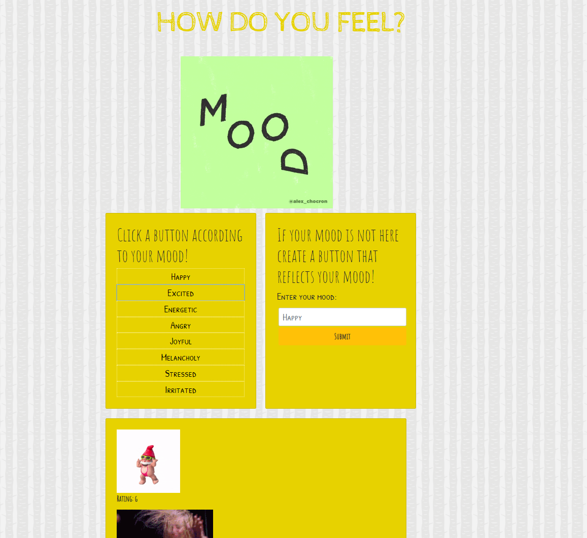
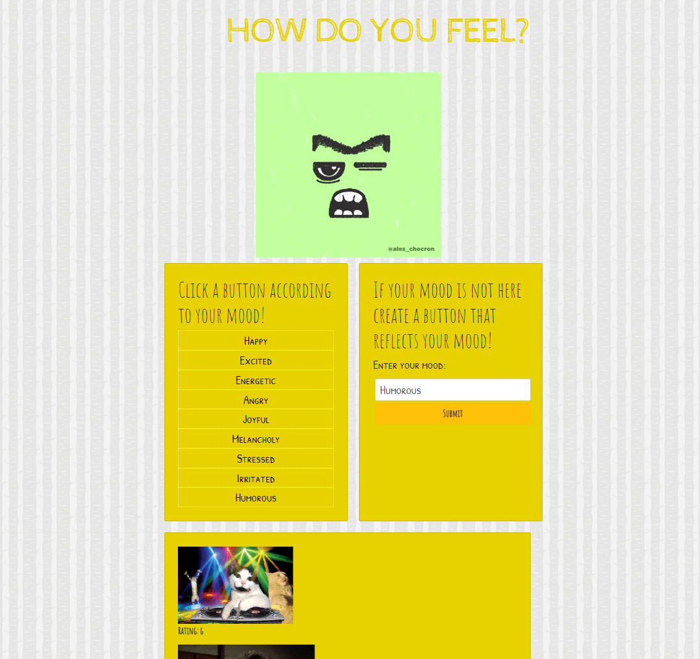

# GifTastic
---------------
## Table of Contents
1. [Abstract](#abstract)
2. [Coding Overview](#overview)
3. [Game Display](#display)

## Abstract

On the left-hand side, there are eight buttons which are referred by a mood. 
When a user clicks any mood button, related gifs line up.
Gifs appear in "still" state once a user clicks it on, its state changes to animate.
On the right-hand side, there is a submit button to add a new mood button.
Once a new button is created, the user can click the created button, and it behaves just like the other existed buttons.

## Coding Overview

The game is built with;
* HTML
* CSS
* Bootstrap
* JavaScript
* jQuery
* Giphy API
* Ajax

## Game Display

 

 

